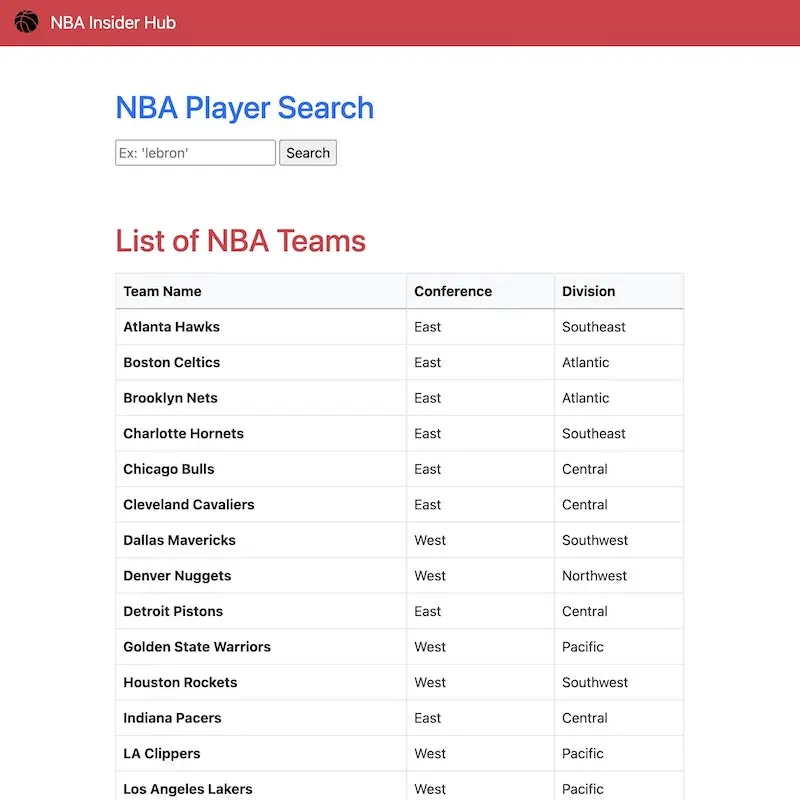
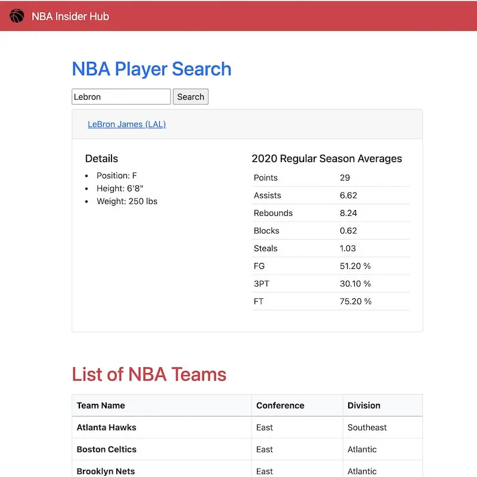

# NBA Insider Hub

4 words: Basketball Player Search Index. Front-end client which connects the balldontlie API, allowing users to see a table of NBA Teams, then search by player name to see latest player stats. Uses Vanilla JavaScript, HTML, and Bootstrap CSS.

## 3/13/24 - Site now offline

The API that this was reliant on, balldontlie.io, recently got put behind a pay wall, and key features like getting season average stats for players is now paid. As a result I'm choosing just to shut this website down since it was just a side project.
